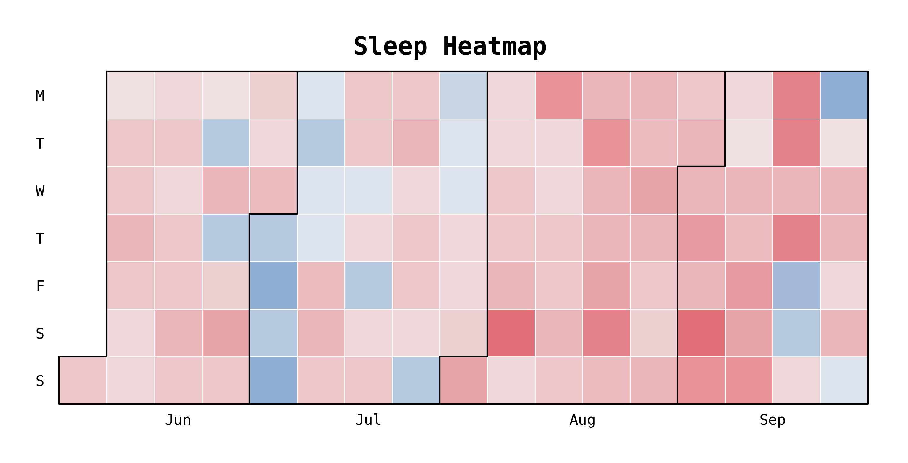

# Sleep Time Heatmap

A sleep time heatmap that shows how daily sleep time differs from sleep target in a monthly calendar view.

## Requirement

Below Python libraries are required to run the script:

- July
- Matplotlib
- Seaborn
- Pandas

## How it works

Sleep time data is logged manually in a csv file which stored on local. A shell script runs every Monday at 5am to update the heatmap and push changes to git repository.

- Sleep time data is logged via csv file
- Set sleep time target to track sleep status
- Customized colour scheme from Seaborn

## Backlogs

- [x] Auto Update the updated date in */sleep/sleepmap.md* on blog repository 